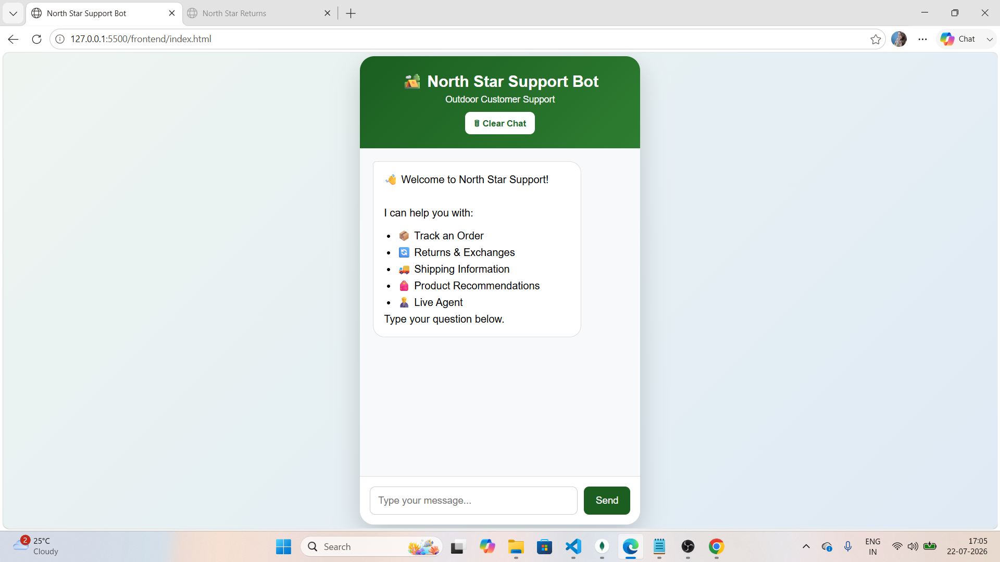
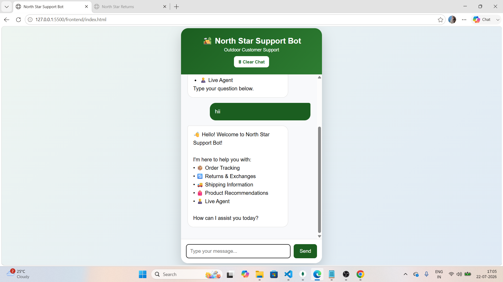
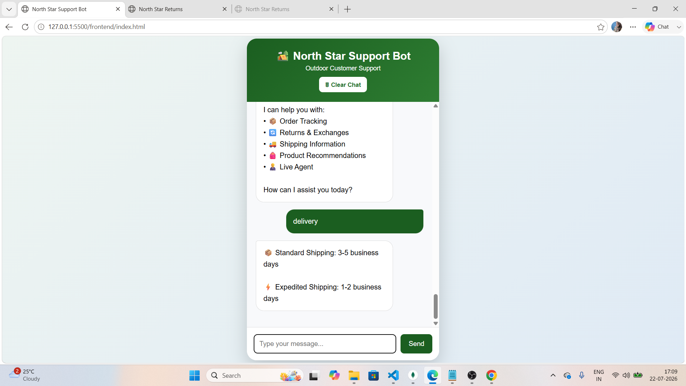
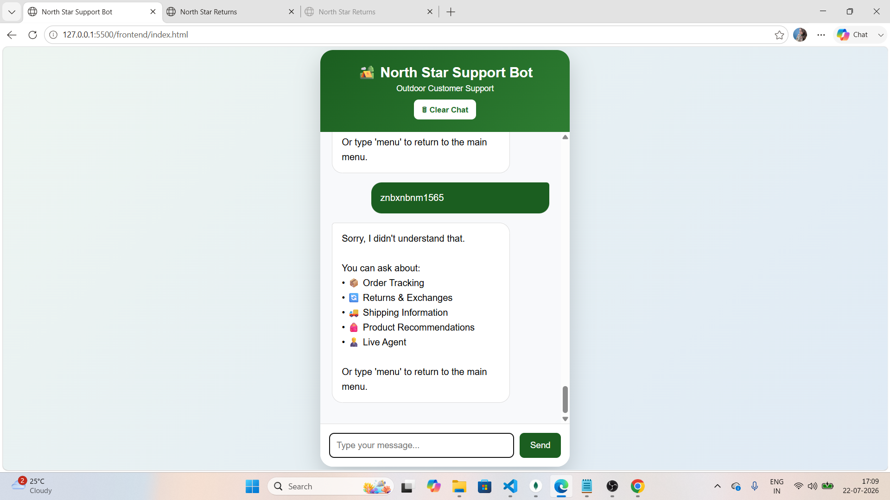

# North Star Support Bot

## Project Overview

North Star Support Bot is a customer support chatbot developed using **FastAPI, HTML, CSS, and JavaScript**.

The main purpose of this project is to help customers with common support queries without requiring a human agent for every request. The chatbot recognizes user intent using keyword matching and responds with predefined information based on mock data.

This project was developed as part of the **Upwork Talent Accelerator Program** to demonstrate backend development, API integration, and frontend interaction.

---

## Features

### Order Tracking
Users can check the status of their order by entering a valid order number. The chatbot supports three mock order numbers:
- 111 – Shipped
- 222 – Processing
- 333 – Delivered

### Returns & Exchanges
The chatbot explains the return policy, including the return window, item condition, and packaging requirements. It also provides a link to a simulated Returns page.

### Shipping Information
Users can ask about shipping methods, and the chatbot displays both standard and expedited shipping times.

### Product Recommendations
The chatbot asks one or two clarifying questions before recommending suitable product categories for activities such as **hiking**, **camping**, or **winter adventures**.

### Live Agent
If the user wants additional help, the chatbot can simulate transferring the conversation to a live support agent.

### User Experience
The chatbot also includes:
- Typing indicator
- Quick action buttons
- Clear chat button
- Simple and responsive interface

---

## Technologies Used

### Backend
- Python
- FastAPI
- Uvicorn

### Frontend
- HTML
- CSS
- JavaScript

---

## Project Structure

```
northstar-support-bot/

backend/
│── chatbot.py
│── data.py
│── intents.py
│── main.py
│── models.py
│── utils.py

frontend/
│── index.html
│── returns.html
│── style.css
│── script.js

screenshots/

README.md
requirements.txt
.gitignore
```

---

## How It Works

1. The user enters a message in the chat interface.
2. The frontend sends the message to the FastAPI backend.
3. The backend identifies the user's intent using keyword matching.
4. Based on the detected intent, the chatbot selects the appropriate response.
5. The response is returned to the frontend and displayed in the chat window.

---

## Mock Order Data

| Order Number | Status |
|--------------|---------|
|111|Shipped|
|222|Processing|
|333|Delivered|

---

## Running the Project

### Install Dependencies

```bash
pip install -r requirements.txt
```

### Start the Backend

```bash
uvicorn backend.main:app --reload
```

### Start the Frontend

Open **frontend/index.html** using **Live Server** in Visual Studio Code.

---

## Sample Queries

You can try questions like:

- Track my order
- Track my order 111
- Where is my order?
- Return policy
- Shipping
- Camping
- Hiking
- Winter gear
- Live agent

---

## Screenshots

### Home


### Greeting


### Order Tracking


### Return Policy


### Product Recommendation


### Live Agent


### Shipping


### Fallback


---

## Future Improvements

Some features that can be added in the future include:

- User authentication
- Database integration
- Real order tracking API
- AI-powered responses
- Conversation history
- Admin dashboard

---

## Author

**Naina Lashkari**

Project created for the **Upwork Talent Accelerator Program**.